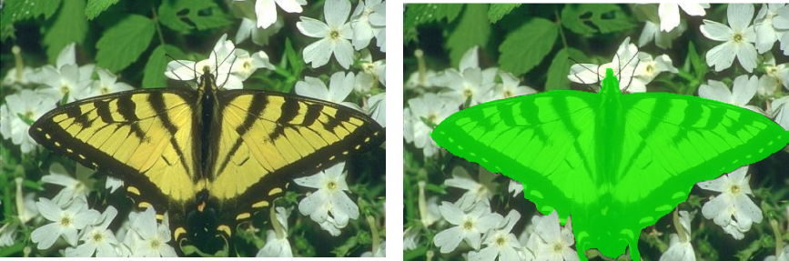
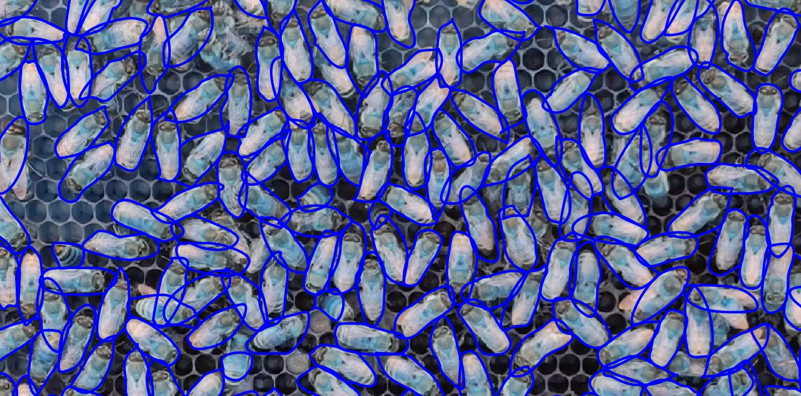

# Bug's Life AI repository

This AI Engineering Computer Vision Service is intended to be a complete insightful source of detection through of a  Convolutional Neural Network Classificator. 
Furthermore, it has the purpose of bringing a business/educational differential advantage to the Bug's Life application.

## Insect Binary Classifier (complete)

This model recognizes and automatically identify if an insect exists or not in a given image.

 The first objective was reached in which a deep learning model was trained successfully, The model was deployed on [Render](render.com) through Docker, Flask, Starlette.

## Second Model (in progress)

This model pretends to recognize species, families and orders of the insect world.

1- Get Dataset (Concluded)
--
Dataset from adults insects and catterpillar from butterflies; specific angle of view and distance; insects without persons, laboratories and homes in the photo; photos in the forests on a daylight.

Total: 6000 Images

2- Construct Notebook requirements (Concluded)
--
8 classes of Convolutional Neural Network is:

Bee, Ant, Cockroach, Dragonfly, Butterfly, Fly, Bettle, Others
(1st Version)

Total Augmented Images: 25600 Images

3- Annotation (IBM Cloud) (Concluded)
--
Make some annotations in IBM Cloud using about 100 images could help me to automate the process in other thousands insects images. I've made a Machine Learning model to learn initial annotations and predict new ones.

4- Data Augmentation (Concluded)
--
Using methods like Cutoff and Mixup directly on training dataset, to insert a dropout in initial layer of the Neural Network A[0].
Also other techniques: (Rotate, Brightness, RandomCrop, Jitter)

5 - Neural Network (In Progress)
--
Constructing a NN with correct BatchSize(32,64) hidden layers(ConvLayers), activations (ReLU), droupouts and normalizations (imagenet_stats) to achieve the best result.
I'd rather use 2 kinds of Frameworks to construct the NN (Keras, Fastai) to ensure the goal of model.

PLUS - Image Segmentation
--
I made a research to visualize better ways to achieve the best accuracy in the model.
Applying techniques like Mask R-CNN and Active contour model, I'm researching how to use instance and semantic segmentations in specific classes of insects.

## ToDo

1- Train the Deep Learning Model  (First Version)  
2- Hyper-parameter Tuning  
3- Evaluate with Real tests  
4- Deploy
